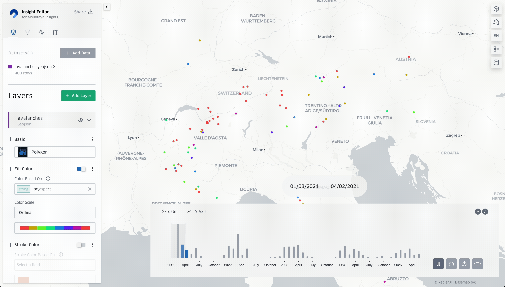

# Mountaya Insight Editor

The **Mountaya Insight Editor** is a powerful, open-source application for creating
insightful geospatial maps. Leveraging the capabilities of [kepler.gl](https://kepler.gl/)
and [DuckDB](https://duckdb.org/), it empowers anyone to design sophisticated maps,
either for private analysis or for sharing within the Mountaya platform as part
of our **Mountaya Insight Series**.



Beyond this open-source editor, Mountaya offers **professional services** to
our partners to transform their geospatial challenges into clear, actionable
insights. We provide comprehensive, end-to-end solutions, including:

- **Custom map design:** Tailored map visualizations, meticulously crafted using
  the Mountaya Insight Editor, to highlight your specific data and objectives with
  precision.
- **Dedicated data pipelines:** Robust infrastructure engineered to seamlessly
  integrate, transform, and process your geospatial data, ensuring efficiency and
  accuracy.
- **Bespoke back-end solutions:** Customized systems designed to fully support
  your unique analytical and mapping requirements, scaling with your needs.

The result of these personalized solutions, known as a **Mountaya Insight**,
is the map exported by the Insight Editor. This workflow ensures a powerful,
seamless, and unified experience across all Mountaya Insights, helping you to
visualize and understand your most complex geospatial challenges with unparalleled
clarity. You maintain full control over your Mountaya Insights, choosing whether
they remain exclusively private to your organization or are shared with the wider
Mountaya community as part of our **Mountaya Insight Series**.

## Get started

Install dependencies:
```sh
$ npm install --legacy-peer-deps
```

Run the application:
```sh
$ npm run dev
```

## Environment variables

- `KEPLERGL_THEME` (optional): The kepler.gl theme to apply. Must be one of
  `light`, `dark`. Default: `light`.
- `MAPBOX_API_TOKEN` (optional): The Mapbox API token in case you need to use
  Mapbox map styles or rely on Mapbox in any other way.

## License

Repository licensed under the [MIT License](./LICENSE.md).
